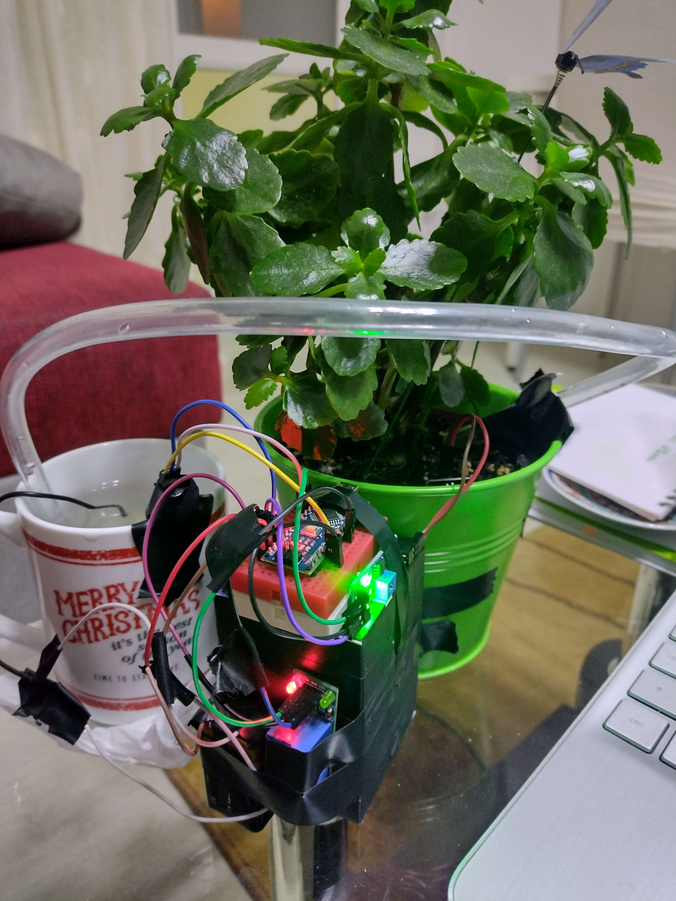

# Arduino - Flowerpot Automation



## About

Automation project for the automated flowerpot!

---> Ro
## Cum să începeți

Instrucțiuni despre cum să obțineți o copie a proiectului și să începeți să lucrați.
... in viitor voi adauga si schema mult mai clara decat in imagine.

## Instalare
```bash
git clone https://github.com/andreireporter13/flowerpot-automation-with-Arduino
cd flowerpot-automation-with-Arduino
```
Si de aici puteti incepe sa testati si dvs.
